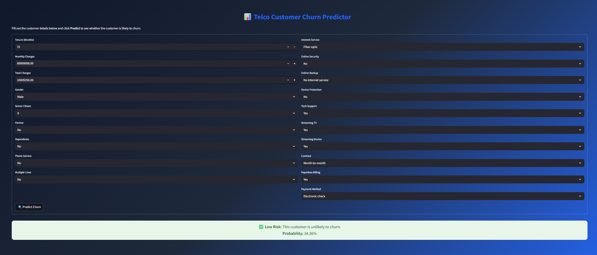

# 📉 Customer Churn Prediction




You can try the model here-- [https://churn-prediction-model-ashh.streamlit.app/]

## 📌 Project Overview
This project predicts **customer churn** (whether a customer will leave a service) using machine learning.  
It is aimed at helping businesses **reduce churn** and **improve customer retention**.

---

## 📊 Business Problem
Customer churn is a major challenge for subscription-based businesses.  
By identifying customers likely to leave, companies can take preventive action like:
- Offering discounts
- Improving customer service
- Personalizing marketing campaigns

---

## 🗂 Dataset
- **Source:** [[WA_Fn-UseC_-Telco-Customer-Churn.csv](../../Downloads/WA_Fn-UseC_-Telco-Customer-Churn.csv)]  

- **Target Variable:** `Churn` (1 = Yes, 0 = No)

Key features used:
- Tenure  
- Monthly Charges  
- Contract Type  
- Internet Service  
- Payment Method  
- gender
- SeniorCitizen
- Dependents
- PhoneService
- etc...
        

---

## 🔧 Approach
1. **Exploratory Data Analysis (EDA)**
   - Handled missing values
   - Visualized churn distribution
   - Encoded categorical variables
2. **Feature Engineering**
   - Created derived features (if any)
   - Standardized numerical columns
3. **Model Building**
   - Tried multiple models ( Random Forest, XGBoost)
   - Tuned hyperparameters
   - Selected the best-performing model
4. **Evaluation**
   - Metrics used: Accuracy, Precision, Recall, F1-score, ROC-AUC

---

## 📈 Results
- **Best Model:** `Random Forest Classifier` (or whichever you used)
- **Accuracy:** `80%`
- **F1-Score:** `80`


---

## 🚀 How to Run Locally

Clone this repo:
```bash
git clone https://github.com/Ashish-ashh/Churn-prediction-model.git
cd churn-prediction-model
```

you can try the model here-- [https://churn-prediction-model-ashh.streamlit.app/]
